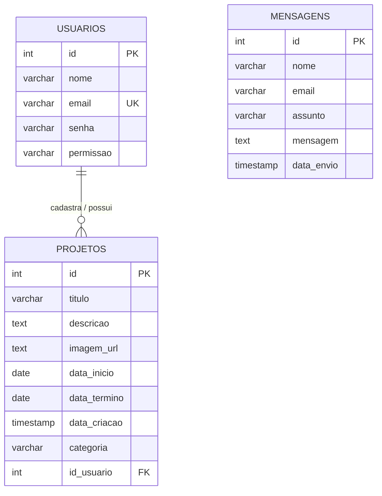

# Descrição do Trabalho

O sistema foi desenvolvido para o gerenciamento institucional de projetos voltados à criação e administração de projetos de lei de incentivo cultural e esportivo.

A aplicação permite o gerenciamento de:

* projetos;
* usuários;
* mensagens enviadas pela página pública do sistema.

O sistema possui uma área pública, onde visitantes podem enviar mensagens através de um formulário de contato sem necessidade de autenticação.

As mensagens enviadas são direcionadas para a área administrativa do sistema, onde podem ser visualizadas e gerenciadas pelos usuários autorizados.

A área administrativa possui três CRUDs principais:

* CRUD de Projetos;
* CRUD de Usuários;
* CRUD de Mensagens.

O controle de acesso é realizado através de autenticação e permissões de usuário.

Os usuários são classificados conforme seu nível de permissão:

* Administrador (ADMIN): possui acesso completo ao sistema, incluindo gerenciamento de usuários, mensagens e projetos;
* Editor: possui acesso apenas ao gerenciamento de projetos.

Os projetos cadastrados podem ser visualizados por todos os usuários autenticados da área administrativa. Entretanto, cada usuário pode editar e excluir apenas os projetos criados por ele próprio, exceto administradores, que possuem acesso total.

# Para rodar crie o banco de dados.

Criar Banco de Dados - "instituto_columbia"

```
CREATE TABLE IF NOT EXISTS public.usuarios (
    id SERIAL PRIMARY KEY,
    nome VARCHAR(100) NOT NULL,
    email VARCHAR(150) NOT NULL UNIQUE,
    senha VARCHAR(255) NOT NULL,
    permissao VARCHAR(20) NOT NULL
);

CREATE TABLE IF NOT EXISTS public.projetos (
    id SERIAL PRIMARY KEY,
    titulo VARCHAR(200) NOT NULL,
    descricao TEXT NOT NULL,
    imagem_url TEXT,
    data_inicio DATE NOT NULL,
    data_termino DATE,
    data_criacao TIMESTAMP DEFAULT CURRENT_TIMESTAMP,
    categoria VARCHAR(50) NOT NULL,
    id_usuario INTEGER NOT NULL DEFAULT 1,
    CONSTRAINT fk_projetos_usuarios FOREIGN KEY (id_usuario)
        REFERENCES public.usuarios (id) 
        ON UPDATE NO ACTION 
        ON DELETE SET DEFAULT
);

CREATE TABLE IF NOT EXISTS public.mensagens (
    id SERIAL PRIMARY KEY,
    nome VARCHAR(100) NOT NULL,
    email VARCHAR(150) NOT NULL,
    assunto VARCHAR(200),
    mensagem TEXT NOT NULL,
    data_envio TIMESTAMP DEFAULT CURRENT_TIMESTAMP
);

INSERT INTO public.usuarios (nome, email, senha, permissao)
VALUES ('Teste', 'teste@columbia.com', '1234', 'ADMIN');

```
# Para acessar a parte administrativa entre com o usuário padrão

## Ele é um usuário do tipo ADMIN

### email: teste@columbia.com 
### senha: 1234

# Modelo Entidade-Relacionamento (ER)

Abaixo está a representação visual e a descrição das tabelas do banco de dados `instituto_columbia`.



### Detalhes das Entidades e Relacionamentos

1. **USUARIOS (`public.usuarios`)**
   * Representa os colaboradores com acesso ao painel administrativo.
   * Possui uma restrição de **E-mail Único (UNIQUE)** para evitar cadastros duplicados.
   * O campo `permissao` controla os níveis de acesso (`ADMIN` ou `Editor`).

2. **PROJETOS (`public.projetos`)**
   * Armazena as iniciativas culturais, esportivas e sociais.
   * Possui relacionamento de **1 para Muitos (1:N)** com a tabela de usuários, mapeado pela chave estrangeira `id_usuario`.
   * **Regra de Integridade:** Configurado com `ON DELETE SET DEFAULT`. Se um usuário for excluído do sistema, a propriedade dos seus projetos é transferida automaticamente para o usuário ID 1 (Administrador padrão), impedindo que os dados fiquem órfãos.

3. **MENSAGENS (`public.mensagens`)**
   * Entidade **Isolada (Sem Relacionamentos Físicos)**.
   * Armazena os dados coletados de forma anônima e sem autenticação no formulário de contato do rodapé da área pública.
